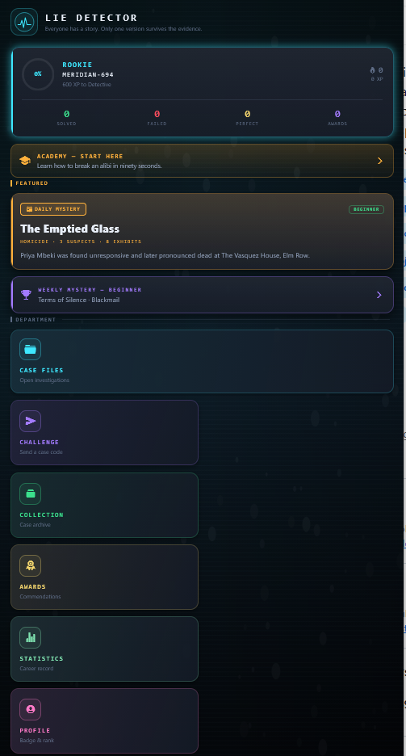
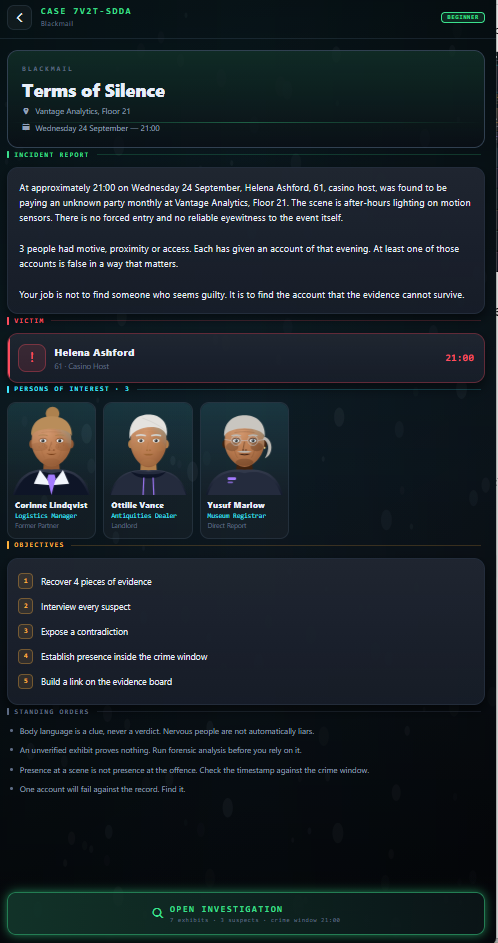
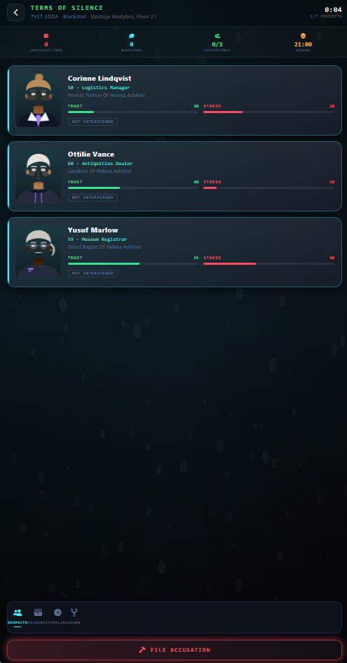
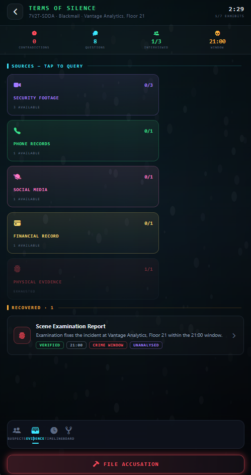
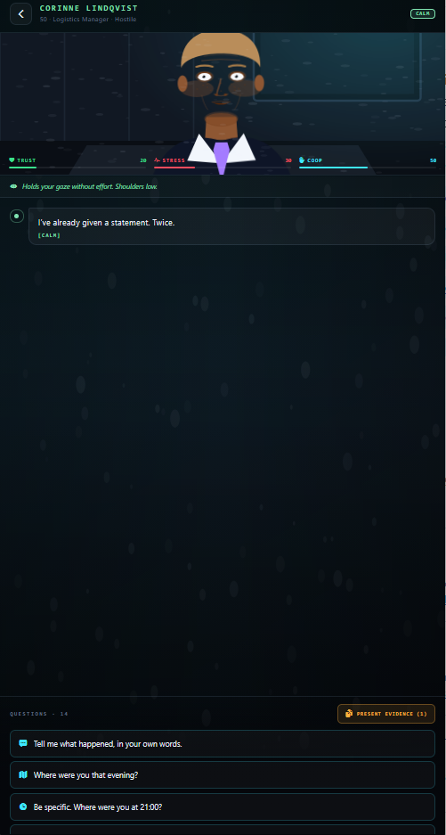
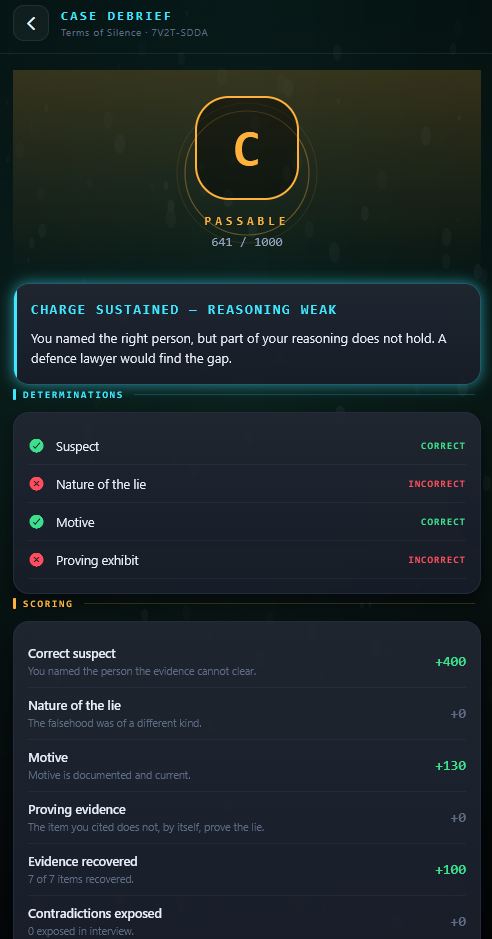

# Lie Detector

A mobile-first detective game built with React Native, Expo and TypeScript. Investigate fictional cases, examine evidence, interview suspects and build an accusation that survives scrutiny.

**Status:** portfolio prototype, with no further standalone development planned. Ideas from Lie Detector and The Empire are intended to inform another project; that integration is not implemented here. Android, iOS and web are configured targets; this repository does not imply a published app-store release. This is a deduction game, not a real-world lie-detection tool.

## Gameplay

- Seeded procedural cases across six difficulty tiers, from Beginner to Impossible.
- Suspect interviews with dialogue choices, evidence presentation and simulated emotional responses.
- Evidence viewers, a timeline, notes and an interactive evidence board.
- Accusations that combine a suspect, the nature of the lie, a motive and supporting evidence.
- Results with scoring breakdowns, XP, career ranks, achievements and case history.
- Daily and weekly seeded cases, plus shareable case codes for playing the same generated case independently.
- Local profile and progress persistence through AsyncStorage.
- Procedural SVG portraits and scenes, bundled sound effects and device haptic hooks.

Challenge codes do not require a multiplayer server. Cloud saves, online leaderboards and real-time multiplayer are not implemented.

## Preview

### Start Screen

The main dashboard provides access to featured cases, case files, challenges, collections, awards, statistics and the player profile.



### Case Briefing

Each case introduces the incident, victim, persons of interest, objectives and standing orders before the investigation begins.



### Investigation

The investigation screen tracks suspects, trust, stress, interview status and progress toward filing an accusation.



### Evidence Analysis

Evidence is organized by source type, recovery status and analysis state, with individual exhibits available for deeper review.



### Suspect Interview

Interviews combine dialogue choices, suspect reactions, trust, stress and evidence presentation.



### Case Results

The case debrief scores the player's accusation, reasoning, motive, evidence selection and investigation performance.



## Run locally

Use Node.js 22.13 or newer (Node 24 recommended) and npm. The checked-in lockfile pins the dependency tree. No API key or backend account is required for local gameplay.

```sh
git clone https://github.com/sknox698-del/lie-detector.git
cd lie-detector
npm ci
npm run web
```

For mobile development:

```sh
npm start
```

Use a client compatible with Expo SDK 57. `npm run android` opens the Android target when a configured emulator/device is available; `npm run ios` requires an appropriate iOS development environment (the simulator requires macOS). Native builds and device behavior need separate verification.

```sh
npm run typecheck
npm test
npm run build:web
```

The web export is generated in `dist/`, which is intentionally ignored. The included Vercel configuration describes static routing; publishing a hosted demo is a separate step. EAS build profiles are included, but contributors must configure their own Expo project, app identifiers and signing credentials before building for distribution. The source archive's old preview-service owner and update endpoint have been removed.

## Technology and structure

Expo SDK 57, React 19, React Native 0.86, TypeScript, React Navigation, Reanimated, React Native SVG, AsyncStorage, Expo Audio and Expo Haptics.

```text
App.tsx             Navigation, providers and error boundary
index.ts            Expo entry point
screens/            Investigation, interviews, results and supporting screens
components/         Shared UI, evidence board/viewers, portraits and scenes
lib/generator.ts    Procedural case construction
lib/dialogue.ts     Interview responses and suspect state
lib/scoring.ts      Accusation evaluation and progression
lib/rng.ts          Seeded randomness and shareable case codes
lib/store.tsx       Game state and actions
lib/storage.ts      Local profile and progress storage
lib/data/           Fictional people, locations and case archetypes
assets/             Runtime images and sound effects
scripts/            Repeatable game-logic smoke checks
```

## Development notes

The project demonstrates procedural content generation, stateful interactive screens, local persistence and separation of game logic from presentation. It is a personal portfolio project; no client deployment or production usage is claimed.

Known boundaries:

- Most content is English. Spanish/French dictionaries exist, but localization is incomplete.
- Some settings are saved without a complete implementation, including adaptive music and high contrast.
- Save-write failures are swallowed by the current storage layer; there is no cloud backup or reliable cross-device sync.
- A successful build is not evidence that every generated case or every mobile interaction has been tested.
- Web audio can be blocked by browser autoplay policy before the first interaction.

See [verification notes](docs/VERIFICATION.md) for the checks actually performed and their limits.

## Source hygiene and attribution

Only project source and required runtime assets are included. Player backups, packaged apps, credentials, caches and generated builds are excluded. Do not commit `.env` files, signing keys, player exports or private screenshots.

The maintainer confirms ownership of the original app code and assets. Original contributions are **all rights reserved**, as described in [LICENSE](LICENSE). The source is public for portfolio review; no general open-source reuse license is offered for original contributions.

The existing Expo MIT notice is preserved verbatim in [notices/EXPO-MIT-LICENSE.txt](notices/EXPO-MIT-LICENSE.txt) for upstream template material. Third-party dependencies retain their own licenses. These notices do not assert ownership of third-party work or remove permissions previously granted. GitHub's applicable viewing and forking rights remain unaffected; see [GitHub's licensing guidance](https://docs.github.com/en/repositories/managing-your-repositorys-settings-and-features/customizing-your-repository/licensing-a-repository).
